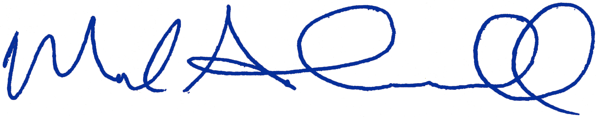

```{r setup, include=FALSE}
knitr::opts_chunk$set(echo = TRUE)
```

\pagestyle{fancy}

\renewcommand{\headrulewidth}{0.5pt}

\renewcommand{\footrulewidth}{0.5pt}

\fancyhead[LO,LE]{}
\fancyhead[CO,CE]{\small{\textbf{Northwest Fisheries Science Center}\textperiodcentered \textbf{National Marine Fisheries Service}\\ 2725 Montlake Blvd E\textperiodcentered Seattle WA 98112}}
\fancyhead[RO,RE]{}
\fancyfoot[LO,LE]{\small{Email: scheuerl@uw.edu}}
\fancyfoot[CO,CE]{}
\fancyfoot[RO,RE]{\small{Tel: 206.406.9055}}


\vspace*{6pt}

3 January 2019

\vspace{12pt}

Dear Search Committee:

I am writing to apply for the position of Assistant Unit Leader for the Washington Cooperative Fish and Wildlife Research Unit at the University of Washington. I am currently a Research Fisheries Biologist at NOAA’s Northwest Fisheries Science Center, and I am also an Affiliate Associate Professor in the School of Aquatic and Fishery Sciences at the University of Washington. I have a strong history of mentoring students, post-docs, and peers, and working in interdisciplinary groups to answer research questions and solve management problems.

I work on a variety of problems related to the conservation and management of aquatic resources, particularly along the west coast of North America. I have a strong background in field research, studying trophic interactions in aquatic food webs and the roles of habitat coupling in structuring ecosystem dynamics. Much of my more recent work has focused on the development of statistical methods for analyzing temporal and spatial data and their application to freshwater and marine ecosystems. The results of my research have formed the basis for fisheries and habitat management decisions in Puget Sound and the Columbia River Basin, and contributed to the natural resource damage assessment following the Deepwater Horizon oil spill in the Gulf of Mexico.

I have devoted much of my career to outreach and the transfer of knowledge to others. Through instruction in formal courses, smaller workshops, and one-on-one mentoring, I strive to help others understand both the underlying concepts and how to apply the appropriate tools to address their problems. I have formally mentored early career scientists locally at our science center and nationally through programs at the Ecological Society of America. I also embrace an open science philosophy whereby I develop reproducible workflows and make them publicly available, something I believe should be emphasized more in graduate education. 

I have a proven ability to communicate results and collaborate effectively as evident from my CV. I have published papers with numerous co-authors in a wide variety of general ecology and fisheries journals, often alongside students and post-docs. I have participated in a number of working groups sponsored by NSF, NCEAS, and USGS. I have also served on expert panels tasked with identifying causes of declines of Pacific salmon in Alaska, British Columbia, and Oregon.

Thank you for taking the time to consider my application.

{width=200px}   
Mark Scheuerell, Ph.D.  
